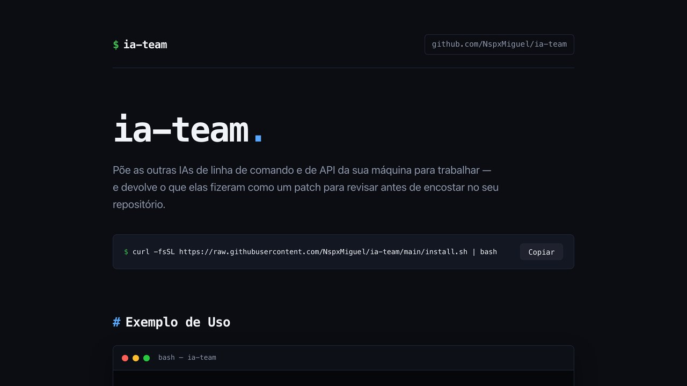

<div align="center">

# ia-team

**Put the other AIs on your machine to work as a team.**

One lead agent splits the job, every teammate works in its own throwaway git
worktree, and what comes back is a patch you read before it touches your branch.

[](docs/EQUIPE-VS-SOLO.md)
[](#the-roster)
[](#tests)
[](#install)
[](LICENSE)



</div>

---

```bash
team sprint "antigravity: the landing page, dark, no framework" \
            "codex: the /api/links route following README.md" \
            "groq: node:test tests for the four routes" \
            "gemini: docs/COMO-USAR.md with curl examples"
```

Four agents, four worktrees, four patches — in the time the slowest one takes.

## Is it worth it? Measured, not assumed

The same two medium-difficulty tasks, the same brief, two clean arenas — three
agents in parallel against one working alone:

| | Three AIs in parallel | One agent alone |
| --- | --- | --- |
| Wall-clock time | **105 s** | **301 s** |
| Cost in dollars (Anthropic) | **$0.47** | **$1.22** |
| Other consumption | 22,842 tokens of the Codex plan; Groq for free | — |
| Own tests passing | 17 | 14 |

**2.9× faster and 2.6× cheaper**, with the mechanical part going to a free
model. How those numbers were produced, what they do not say, and when splitting
the work is *not* worth it are in
[docs/EQUIPE-VS-SOLO.md](docs/EQUIPE-VS-SOLO.md).

## Install

```bash
curl -fsSL https://raw.githubusercontent.com/NspxMiguel/ia-team/main/install.sh | bash
```

Installs the `team` command in `~/.local/bin`, the adapters and the API runner
in `~/.ia-team`, and a `team` skill for Claude Code in `~/.claude/skills/team`.
Requires `git` and `python3`, nothing else.

## What it looks like

`team doctor` is the first thing to run. It says who is installed, who is signed
in, and who is out of quota — the roster is whatever your machine already has:

```console
$ team doctor
team doctor (v0.2.0)
  home: /Users/you/.ia-team

  ✓ antigravity  agy 1.1.22
  ◔ cerebras     out of quota, back in 29d23h
  ✓ claude       2.1.212 (Claude Code)
  ◔ codex        out of quota, back in 5h31m
  ✓ cursor       2026.08.25-3e8eec8 [cursor-grok-4.6-high]
  ✓ gemini       gemini 0.56.0
  ✓ groq         openai/gpt-oss-120b (key in the keychain)
  ✓ opencode     1.18.14
  ✓ openrouter   deepseek/deepseek-chat-v3.1:free (key in the keychain)
  ! mistral      no MISTRAL_API_KEY — see: team hire mistral
  · ollama       Ollama is running but has no model pulled
```

Then a sprint hands one task to each of them and returns one patch per task:

```console
$ team sprint "antigravity: the landing page, dark, no framework" \
              "codex: the /api/links route following README.md" \
              "groq: node:test tests for the four routes"

  antigravity  worktree r-4f21  ✓ 96s   patch 3 files, +214 −0
  codex        worktree r-4f22  ✓ 141s  patch 2 files, +96 −4
  groq         worktree r-4f23  ✓ 38s   patch 1 file,  +130 −0

  team diff r-4f22     # read it
  team apply r-4f22    # then, and only then, it touches your branch
```

## The roster

`team` ships no model of its own. It drives the CLIs already installed, and any
OpenAI-compatible API you have a key for. `team doctor` reports who is actually
available right now.

**Command-line teammates**

| Adapter | Runs | Good at |
| --- | --- | --- |
| `codex` | `codex exec` | Big refactors, backend, following a spec literally |
| `antigravity` | `agy -p` | UI, landing pages, CSS, quick prototypes |
| `gemini` | `gemini -p` | Huge context, long documents, docs |
| `claude` | `claude -p` (Haiku) | A second read of a diff, cheap wide sweeps |
| `opencode` | `opencode run` | Another provider's opinion |
| `cursor` | `cursor-agent -p` | Frontend, edits spread across many files |

`cursor` runs on **`cursor-grok-4.6-high`**, not on `auto`. The `cursor-grok-*`
and `composer-*` families are the ones with the large limits; `auto` picks for
itself and picks expensive, which on a shared account spends someone else's quota.
A model outside those two families is refused before the call — `TEAM_CURSOR_MODEL`
changes the default, `TEAM_CURSOR_ANY_MODEL=1` lifts the guard.

**API teammates** — a small agent loop (`runner/cloud_agent.py`) gives them file
tools, so they edit the repository instead of describing a patch:

| Adapter | Free tier | Good at |
| --- | --- | --- |
| `groq` | yes | Bulk work and tests, answers in seconds |
| `nvidia` | yes | Reasoning, a second architecture opinion |
| `openrouter` | yes | Breadth: many vendors behind one key |
| `cerebras` | yes | The fastest of the lot, repetitive edits |
| `mistral` | yes | Refactors, code completion |
| `together` | free credit | Open models, parallel bulk work |
| `deepseek` | paid, cheap | Hard reasoning, long refactors |

`team hire` prints what is missing and how to get it. Keys are read from the
environment, or from your OS keychain through
[`claude-autonomous secret`](https://github.com/NspxMiguel/claude-autonomous) —
they never pass through the agent's context.

## Commands

```
team doctor                      who is available, signed in, and has quota
team agents                      the roster and what each one is good at
team hire [name]                 how to add someone who is not set up yet
team quota [--clear [agent]]     who is benched, and until when

team run <agent> "task"          one task, isolated worktree, patch out
team sprint "t1" "codex: t2" ... several tasks at once, one agent each
team standup                     who is working right now
team ask <agent> "question"      read-only question
team panel "question"            the same question to everyone, in parallel

team board [n]                   the team's shared notes
team note <author> "text"        leave a note for the next agent
team relay <from> <to> "text"    send one agent a message
team crosscheck <id> [--by x]    have another agent review a patch

team runs | show | diff | apply | drop | wait
team suggest [--force|--mute]    offer to bring more AIs in (asked once)
team port [--global]             teach Codex/Gemini/opencode to use the team too
```

Options for `run`, `sprint`, `ask` and `panel`: `--dir`, `--model`, `--timeout`
(default 900s), `--file` to attach a spec or mockup, `--here` to skip the
worktree, `--bg` to start and keep working.

## How a run works

1. `git worktree add` from `HEAD` into `~/.ia-team/worktrees/<id>`. Uncommitted
   changes are carried over and frozen as a starting commit, so the patch that
   comes back is the agent's work and nothing else.
2. A brief is written: the task, the working agreement (stay here, do not run
   git, match the existing style), the recent board notes, and any message
   addressed to that agent.
3. The agent runs headless under a timeout. `~/.ia-team/runs/<id>` keeps
   `brief.md`, `report.md`, `log.txt`, `patch.diff` and `meta.json`.
4. The report goes on the board when the run finished — a run that crashed
   keeps its output in the log instead of posting the error as team news —
   and anything the agent flagged with `TIP:` reaches the rest of the team.

Nothing is committed or pushed by an agent — and if one commits inside its own
worktree anyway, the patch is still captured, because the diff is taken against
the starting commit.

## Running out of quota

Free tiers end mid-job. The API runner waits out per-minute rate limits and
carries on; when an agent is genuinely out — credits gone, plan cap hit — it is
benched with a timer and the work is handed to someone else automatically.

```bash
team quota                # who is benched and until when
team quota --clear groq   # put them back early
```

## Working in parallel without stepping on each other

Split by files, not by feelings: two agents in the same file produce two patches
that fight. `team sprint` reports overlapping files when it happens.

Write the contract first — one `team note` with the routes, file names and
signatures — and four agents build against the same interface instead of
inventing four.

## Tests

```bash
tests/test.sh
```

49 checks over the parts that do not need a model: adapters, briefs, worktrees,
patch capture (including from an agent that commits), the board, relays,
sprints, quota benching and hand-off, the once-only suggestion, and porting.

## What it does not do

- **It does not supply models.** `team` drives CLIs and API keys you already
  have. With nothing installed and no key, `team doctor` is an empty roster.
- **It does not merge for you.** No agent commits, pushes, or touches your
  branch. Applying a patch is always a command you type.
- **It does not resolve two agents editing the same file.** Split the work by
  files; `sprint` warns about the overlap but will not decide for you.
- **It is not faster for a single small task.** Setting up a worktree and a
  brief costs a few seconds — below that, run the agent yourself.
- **Free tiers run out mid-job.** Benching and hand-off soften it, but a sprint
  can still finish with one task undone. `team runs` shows which.
- **Headless agents cannot ask questions.** A brief that is vague comes back as
  a patch that is wrong, quickly.

## Links

- Project page: <https://www.nspx.dev/ia-team/>
- Every command in detail: [docs/COMANDOS.md](docs/COMANDOS.md)
- How the measurement was run: [docs/EQUIPE-VS-SOLO.md](docs/EQUIPE-VS-SOLO.md)

## License

MIT — see [LICENSE](LICENSE).

<div align="center">

Made by [@NspxMiguel](https://github.com/NspxMiguel) · [nspx.dev](https://www.nspx.dev)

</div>
